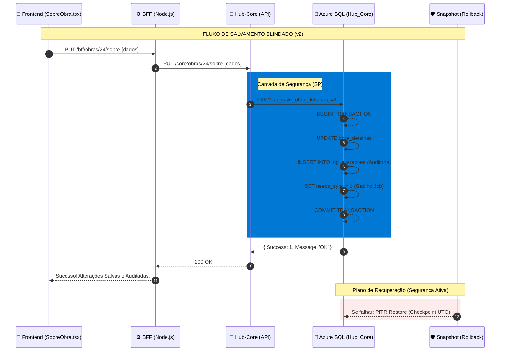

# US07 - Pipeline de Sincronização Reativa (Dashboard)

**Status:** ✅ Concluída (Produção-Ready)

## 📋 Resumo
Implementação de um pipeline de sincronização contínuo que transforma mensagens brutas do Service Bus (SGO e Protheus) em snapshots prontos para consumo pelo Dashboard Executivo.

## 🚀 Entregas Técnicas
1.  **Background Integrator (hub-integrator)**:
    *   Transformado em um **Serviço Contínuo** (Infinite Loop).
    *   **Intervalo Dinâmico**: Lê a configuração `INTEGRATOR_INTERVAL_MIN` do banco de dados em tempo real.
    *   **Mecanismo de Upsert**: Resolvido problema de persistência para obras que não existiam previamente no frontend.
2.  **Infraestrutura de Configuração**:
    *   **Tabela `hub_core.configuracoes_sistema`**: Criada para armazenar parâmetros globais do sistema.
    *   **Endpoints Protegidos**: CRUD de configurações exposto via BFF (com auth MSAL).
3.  **Interface de Administração**:
    *   **IntegratorConfigCard**: Componente premium na página de simulações que permite ao administrador ajustar o tempo de sync sem mexer em código ou variáveis de ambiente.

## 🛠️ Tecnologias Utilizadas
*   **Worker**: Node.js (Loop infinito com `setTimeout` dinâmico).
*   **Database**: SQL Server (Schema `hub_core`).
*   **Frontend**: React + Tailwind + MSAL Auth.

---

## 🎯 Objetivo
Migrar a fonte da verdade para o schema `hub_core` e garantir uma sincronização reativa e auditável entre o transacional (Core) e o executivo (Frontend).

---

## 🛠️ Sub-Histórias (Grânulos de Implementação)

### [US07.1 a US07.5]: Visualização e Gráficos (Status: UX Sincronizado)
*Ver detalhes anteriores...* (Mapeamento de barras, eixos e legendas Recharts).

### 📋 US07.6: Ranking Qualitativo de Pendências
*Ver detalhes anteriores...* (Tabela de top 7 blockers com aging).

### 🏛️ US07.7: Integridade Transacional e Log (NOVO)
**Descrição:** Implementação da Stored Procedure `sp_core_save_obra_detalhes` no `hub_core`.
- **Ação:** Centralizar o UPDATE de campos (Datas, Durações, Local, Equipe).
- **Log de Alterações:** A SP deve inserir automaticamente um registro na tabela `hub_core.log_alteracoes` contendo: Usuário, Campo, Valor Antigo, Valor Novo.
- **Refresh Reativo:** Ao final do save, a SP deve marcar a obra na tabela `refresh_queue` para que o Job Sincronizador priorize o snapshot deste dashboard imediatamente.

---

## 🏗️ Arquitetura de Sincronização (Master Plan)

### 1. Camada de Escrita (CRUD)
- **Origem:** Frontend (UI Editar)
- **Processamento:** BFF -> Core API -> **Stored Procedure (Hub_Core)**
- **Integridade:** Gravação atômica do Dado + Log.

### 2. Camada de Sincronização (Integrator)
- **Gatilho:** Agendamento (15min) OU **Gatilho Reativo (fila de refresh)**.
- **Processamento:** Agrega dados brutos -> Transforma em JSON Recharts -> Grava no `hub_frontend.dashboard_snapshot`.

### 3. Camada de Leitura (Dashboard)
- **Consumo:** BFF -> `SELECT dashboard_json FROM hub_frontend.dashboard_snapshot`.
- **Performance:** Resposta < 100ms (sem cálculos em tempo de execução).

---

### 🔄 Fluxo de Integridade Transacional (v2)

---

## 📈 Critérios de Aceitação de Arquitetura
1. **Auditabilidade**: Cada clique em "Salvar Alterações" deve gerar um rastro no Log de Alterações.
2. **Reatividade**: Após salvar, o dashboard deve refletir as novas durações/datas em no máximo 5 segundos.
3. **Resiliência**: Falhas no Job Sincronizador não devem impedir o CRUD de funcionar (O transacional é soberano).

---

## 🛡️ Plano de Recuperação e Segurança (Rollback - Zero Cost)

Para garantir que a estabilidade de produção seja preservada durante a migração para o Hub_Core, adotaremos o seguinte protocolo:

1. **Checkpoints PITR (Azure SQL)**: 
   - Registro obrigatório do Timestamp UTC antes de cada execução de script DDL/DML em produção. 
   - Uso do Point-In-Time Restore nativo para retorno imediato em caso de corrupção de dados.

2. **Scripts de Backout**: 
   - Todo arquivo `migration_vX.sql` deverá vir acompanhado de um `rollback_vX.sql`.
   - Teste obrigatório do rollback em ambiente de homologação antes do deploy.

3. **Snapshots de Dados (Git-Safe)**:
   - Extração do estado atual das tabelas `obra_detalhes` e `equipe_tecnica` em formato JSON/SQL antes da migração.
   - Armazenamento desses snapshots no diretório `scratch/snapshots/` para recuperação manual via script, se necessário.

4. **Zero Downtime Strategy**:
   - As Stored Procedures serão criadas com nomes novos (v2) para coexistirem com a lógica antiga durante o período de transição, permitindo uma chaveada rápida e segura.
